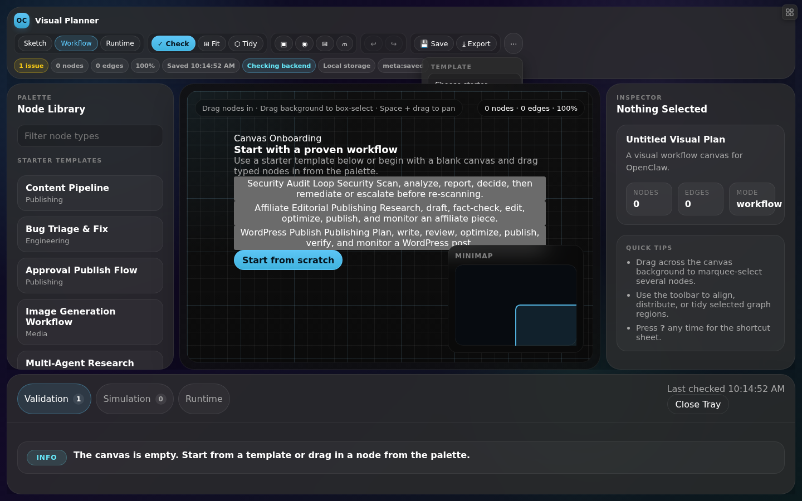

# OpenClaw Visual Planner

Visual workflow planner for [OpenClaw Project WebOS](https://github.com/pgedeon/openclaw-project-webos) — design, simulate, execute, and monitor agent workflows on a canvas.

## What It Is

A native windowed app inside the WebOS desktop shell that lets you:

- **Sketch** workflows visually with typed nodes and edges
- **Formalize** sketches into structured pipeline definitions
- **Validate** graphs before execution
- **Simulate** dry runs to catch issues early
- **Execute** workflows and watch live state on the same canvas
- **Integrate** with tasks, agents, tools, approvals, and artifacts

## Status

🟢 **Phase 4 complete** — full standalone planner with backend, workflow export, and simulation

See [PROGRESS.md](./PROGRESS.md)

## Screenshots

### Main View — Canvas with Palette, Inspector, and Tray


### Toolbar with Overflow Menu

The toolbar keeps core actions visible while less-frequent tools live in the ⋯ overflow dropdown.



 for detailed phase tracking and milestones.

## Quick Start

```bash
npm install
npm start
# Open http://localhost:3000
```

Or open `index.html` directly in a browser (localStorage-only mode, no server required).

## Scope

Read the full product spec: [SPEC.md](./SPEC.md)

Covers node types, edge system, canvas interaction, side panels, templates, runtime overlays, data model, API endpoints, testing plan, and delivery phases.

## Features

- Infinite SVG canvas with pan, zoom, grid, and minimap
- 12 typed node types (note, task, agent, tool, workflow-step, decision, approval, runbook, artifact, memory, external-api, group)
- 7 edge types with visual styling
- Validation engine with issue detection
- Simulation with execution order, dead ends, and risk analysis
- Workflow JSON export compatible with OpenClaw dispatcher
- Backend API with SQLite persistence and version history
- Server browser modal for opening/saving plans
- 6+ built-in templates for common workflows
- Undo/redo, copy/paste, marquee selection, auto-layout

## Related

- [OpenClaw Project WebOS](https://github.com/pgedeon/openclaw-project-webos) — desktop shell target
- [OpenClaw](https://github.com/openclaw/openclaw) — agent runtime

## License

Apache License 2.0 with commercial use restriction.

Free for individuals, open-source projects, non-profits, educational institutions, and companies with annual revenue ≤ $500,000 USD.

Commercial entities with annual revenue exceeding $500,000 USD must obtain a commercial license. Contact **petermgedeon@gmail.com** for details.

See [LICENSE](./LICENSE) for full terms.
